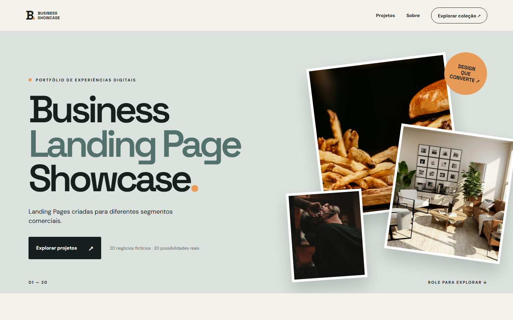
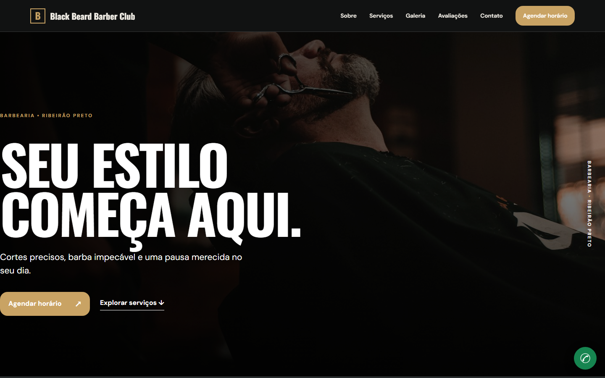
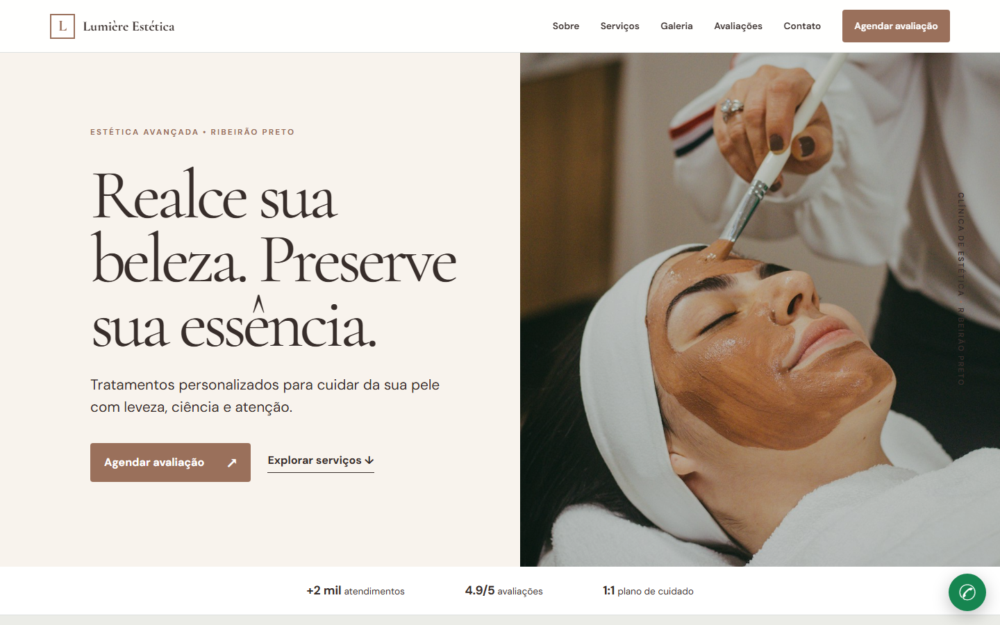
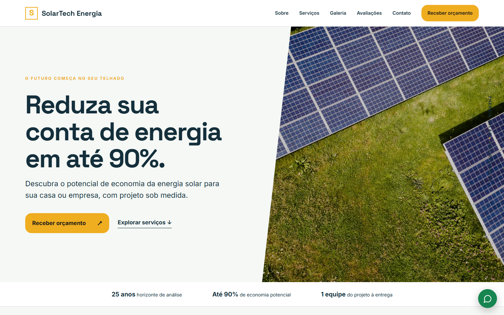
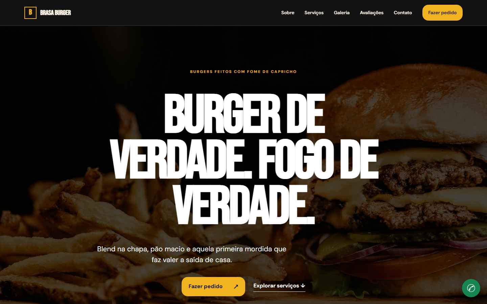
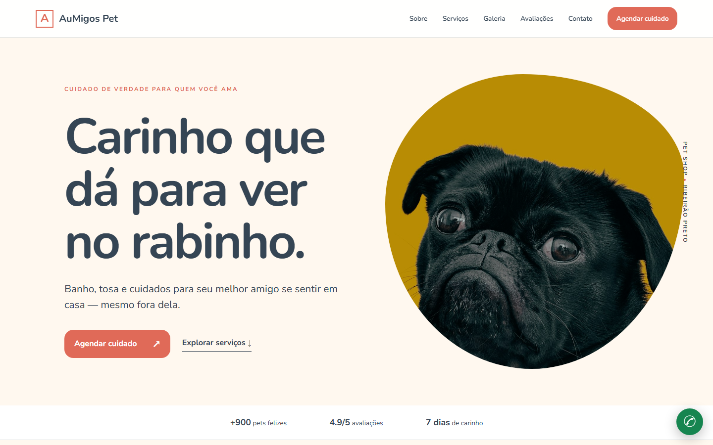

# Business Landing Page Showcase

Coleção de **23 websites demonstrativos** para portfólio comercial. Cada página apresenta uma empresa fictícia com identidade, conteúdo e percurso de conversão próprios. Os exemplos foram criados para mostrar a pequenos negócios como um site pode apresentar serviços e gerar conversas.

> **Aviso:** empresas, avaliações, preços, endereços e resultados apresentados são fictícios. O número de WhatsApp das 23 demos é demonstrativo; os CTAs da vitrine principal usam o contato do autor. Formulários não armazenam dados nem enviam mensagens automaticamente.

## Projetos

| Projeto | Segmento | Demo |
|---|---|---|
| Black Beard Barber Club | Barbearia | [Ver demo](projects/barbershop/index.html) |
| Lumière Estética | Clínica de estética | [Ver demo](projects/aesthetic-clinic/index.html) |
| Odonto Prime | Clínica odontológica | [Ver demo](projects/dental-clinic/index.html) |
| SolarTech Energia | Energia solar | [Ver demo](projects/solar-energy/index.html) |
| AuMigos Pet | Pet shop | [Ver demo](projects/petshop/index.html) |
| Atlas Construções | Construção e reforma | [Ver demo](projects/construction/index.html) |
| BlackCar Detail | Estética automotiva | [Ver demo](projects/auto-detailing/index.html) |
| Brasa Burger | Hamburgueria | [Ver demo](projects/restaurant/index.html) |
| ClimaPro | Ar-condicionado | [Ver demo](projects/air-conditioning/index.html) |
| Vivere Imóveis | Empreendimento imobiliário | [Ver demo](projects/real-estate/index.html) |
| IronFit | Academia | [Ver demo](projects/gym/index.html) |
| Linea Planejados | Móveis planejados | [Ver demo](projects/furniture/index.html) |
| VoltPro Serviços Elétricos | Eletricista | [Ver demo](projects/electrician/index.html) |
| Frame Studio | Fotografia | [Ver demo](projects/photographer/index.html) |
| Villa Garden Eventos | Espaço de eventos | [Ver demo](projects/events/index.html) |
| CleanHouse | Limpeza profissional | [Ver demo](projects/cleaning/index.html) |
| CodeStart Academy | Curso de programação | [Ver demo](projects/school/index.html) |
| Nexus Consultoria Empresarial | Consultoria | [Ver demo](projects/professional-services/index.html) |
| Torque Garage | Oficina mecânica | [Ver demo](projects/mechanic/index.html) |
| Doce Encanto | Confeitaria | [Ver demo](projects/bakery/index.html) |
| Clareza Direito Público | Direito do servidor público | [Ver demo](projects/public-law/index.html) |
| Vértice Soluções Industriais | Serviços industriais | [Ver demo](projects/industrial-services/index.html) |
| Escola Caminho dos Valores | Escola comunitária | [Ver demo](projects/community-school/index.html) |

## Tecnologias

HTML5, CSS3, JavaScript ES6+, CSS Variables e Google Fonts. Sem framework ou backend. A vitrine tem filtro e busca; as páginas incluem navegação móvel, animações discretas, FAQs e formulários demonstrativos. Algumas demos trazem simulador solar, comparação visual, cardápio em modal, galeria ampliada e contador de turma.

## Como executar

Abra `index.html` no navegador ou inicie um servidor estático na pasta:

```sh
python -m http.server 8000
```

Depois acesse `http://localhost:8000`. Para publicar no GitHub Pages, configure a branch principal e a raiz `/` como fonte; todos os links são relativos.

## Estrutura

```text
assets/css/       Estilos da vitrine e base funcional das demos
assets/js/        Busca, filtros, navegação e formulários
assets/images/    Fotografias otimizadas e favicon
projects/         23 páginas independentes, cada uma com HTML/CSS/JS
build.py          Conteúdo editorial e geração das páginas
```

Edite textos, serviços, paletas e composições no `build.py` e execute `python build.py`. O site publicado usa somente os arquivos estáticos gerados.

## Screenshots



| Barbearia | Estética | Energia solar |
|---|---|---|
|  |  |  |

| Hamburgueria | Pet shop |
|---|---|
|  |  |

## Objetivo

Servir como portfólio comercial para apresentar possibilidades de landing pages a empresas de diferentes segmentos. Cada site é um conceito visual demonstrativo. O cliente pode contratar o modelo como está ou solicitar alterações em conteúdo, identidade visual e funcionalidades. Escopo, entrega e direitos de uso são combinados individualmente.

As demos **Clareza Direito Público**, **Vértice Soluções Industriais** e **Escola Caminho dos Valores** foram inspiradas nos segmentos apresentados em [mariobrunhara.com.br](https://mariobrunhara.com.br/), [ssiservicos.com](https://ssiservicos.com/) e [escolasairp.org.br](https://escolasairp.org.br/), respectivamente. São conceitos independentes, sem vínculo com essas instituições.

## Créditos e licença

Criação e direitos autorais do código: [MrPowerUp82](https://github.com/MrPowerUp82).

Fotografias: [Unsplash](https://unsplash.com/license). Fontes: [Google Fonts](https://fonts.google.com/). Ícone: [Lucide](https://lucide.dev/). Código e design com [todos os direitos reservados](LICENSE). O uso comercial de um modelo ou de uma versão adaptada depende de acordo com o autor.
